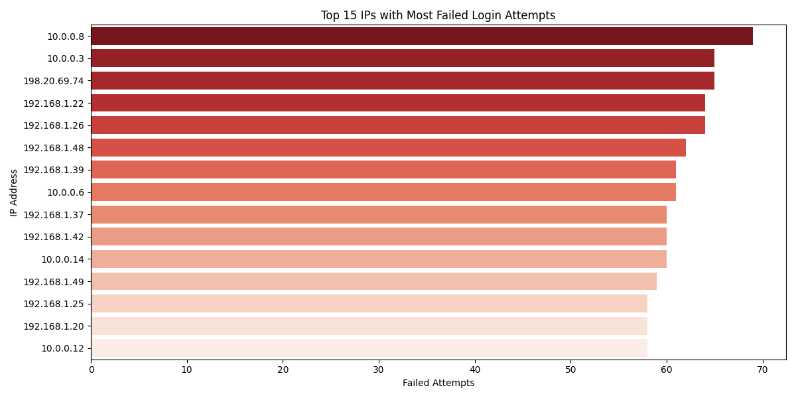
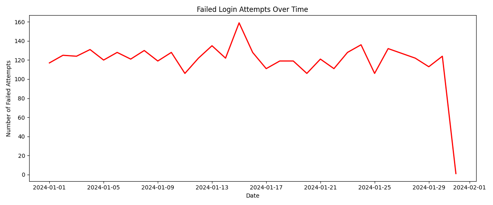
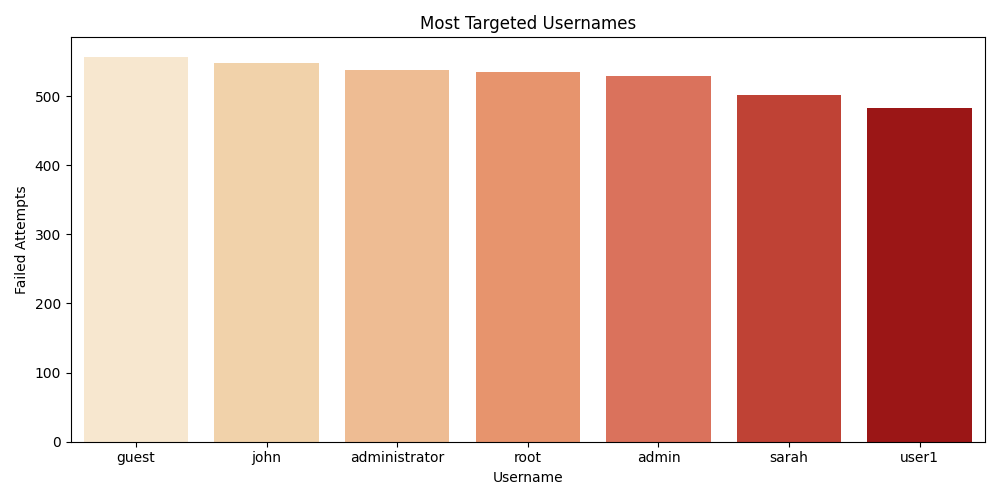

# Log Analysis & Threat Detection System

A Python-based SOC analyst workflow simulation that detects 
suspicious login activity from server logs.

## Tools Used
- Python, Pandas, Matplotlib, Seaborn
- Streamlit (interactive dashboard)
- Jupyter Notebook

## Features
- Generates realistic server log data
- Detects brute force login attempts
- Flags high threat IPs automatically
- Classifies threats as HIGH / MEDIUM / LOW
- Interactive Streamlit web dashboard

## How to Run
pip install -r requirements.txt
streamlit run app.py

## Screenshots

